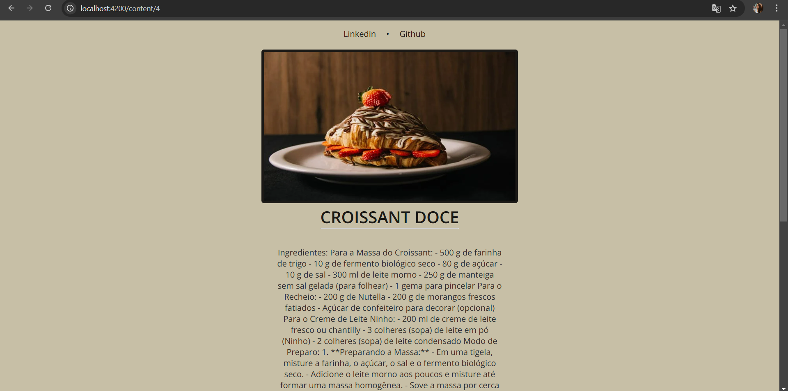
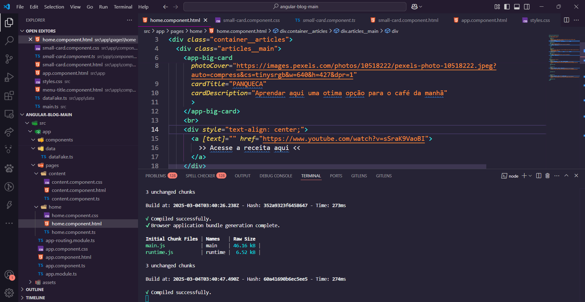

# 📝 Blog Simples com Angular
Este projeto consiste na construção de um blog simples utilizando Angular e TypeScript, desenvolvido como parte de uma sequência de aulas, onde foi abordado desde a pesquisa de layout até a fase final do desenvolvimento.

## 🚀 Tecnologias Utilizadas
As principais tecnologias e ferramentas utilizadas no projeto são:

    
    
    
    

## 📋 Requisitos do Projeto
O projeto foi estruturado visando organização e reutilização de componentes, seguindo boas práticas de desenvolvimento:

- **Componentes Criados:**
  - `menu-title`
  - `menu-bar`
  - `small-card`
  - `big-card`
- **Pasta `data`**: Armazena scripts e dados utilizados no projeto.
- **Pasta `content`**: Responsável pelaos dados passados na rota /content/id na dinâmica das páginas.
- **Pasta `Componentes`**: Organiza e permite uma estrutura mais limpa e aumenta a legibilidade do código.

## 🎯 Melhorias Implementadas
Além da reprodução do projeto original, fiz algumas melhorias:

- No `big-card`, adicionei **links para receitas no YouTube**.
- No `small-card`, adicionei **receitas escritas**, pois algumas pessoas preferem ler enquanto outras preferem assistir vídeos.

Embora não sejam mudanças extraordinárias, essas melhorias me permitiram consolidar conceitos importantes e ganhar mais experiência prática.

## 🖥️ Imagens do Projeto
As imagens do funcionamento do projeto estão disponíveis abaixo:

    
    
    

